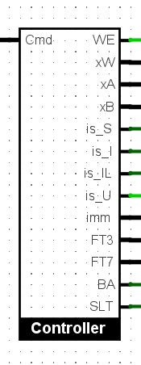
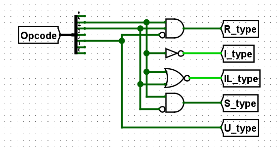

# Project 2 - RISC-V Processor Documentation

## Table of Contents
  - [Overview](#overview)
  - [Fetch](#fetch)
    - [IC4](#ic4)
  - [Decode](#decode)
    - [Decoding instruction parts](#decoding-instruction-parts)
    - [Detecting format types](#detecting-format-types)
    - [Register file interface](#register-file-interface)
    - [12-bit immediate values](#12-bit-immediate-values)
    - [Controller output pins](#controller-output-pins)
      - [Type detector](#type-detector)
      - [32-bit immediate values](#32-bit-immediate-values)
      - [funct3, funct7](#funct3-funct7)
      - [LB/SB, SLT instruction signals](#lbsb-slt-instruction-signals)
  - [Execute](#execute)
    - [Supporting circuits](#supporting-circuits)
      - [ALU Op parser](#alu-op-parser)
      - [SA](#sa)
    - [R-type format](#r-type-format)
    - [I-type format](#i-type-format)
    - [S-type format](#s-type-format)
    - [U-type format](#u-type-format)
  - [Memory](#memory)
  - [Write-back](#write-back)
  - [Special handling for specific instructions](#special-handling-for-specific-instructions)
    - [SLL, SRA, LUI](#sll-sra-lui)
    - [SLT, SLTI](#slt-slti)

## Overview

This is a Logisim design of a 32-bit RISC-V processor. It supports a subset of RISC-V instructions listed below.

|Format|Instructions|
|:-:|:-|
|R-type|ADD, SUB, AND, OR, XOR, SLT, SLL, SRA|
|I-type|ADDI, ANDI, ORI, XORI, SLTI, LW, LB|
|S-type|SW, SB|
|U-type|LUI|

Each stage is illustrated in the below diagram. This document will be organized according to the 5 stages of instruction.

## Fetch
At this stage, instructions from the Program ROM will be fetched to the decoder.

The Program Counter (PC) value is stored in a register, then continuously fetched to the Program ROM and increased by 4 for each clock rising edge.

### IC4
The IC4 circuit adds 4 to the input by separating the least 2 bits 0 and 1, then incrementing 1 to bit 2 (), and merging these two together by a splitter, so that the whole process can be achieved by a single incrementer.

## Decode

The Controller circuit decodes the incoming instruction into multiple parts and send them to their approriate function circuits.

### Decoding instruction parts
These mix of splitters split the incoming instruction into all possible parts regardless of the combination according to the RISC-V instruction format.

### Detecting format types
This part detects what format type the instruction is. By getting the 7-bit opcode of the instruction and split those bits, this circuit can classify the format according to its unique characteristics from the others.

|Opcode|Format|Characteristics|
|:-:|:-:|:--|
|0**11**0**0**11|R-type|Bit 2 is off and bits 4, 5 are on|
|0**0**10011|I-type|Bit 5 is off|
|0**00**0011|IL-type|Bit 5 is off (I-type) **and** bit 4 is off|
|0**10**0011|S-type|Bit 4 is off and bit 5 is on|
|0110**1**11|U-type|Bit 2 is on|

Note that, in this circuit design, a format named IL-type is defined. IL-type is a subset of I-type format specifically for the `LB` and `LW` instructions to differentiate from other I-type instructions `ADDI, ANDI, ORI, XORI, SLTI`. It is not an official specification in RISC-V documentation; rather it is a convention for this project only.

### Register file interface

These output pins are connected to their respective register file input pins. `xW, xA` and `xB` are connected to tunnels `rd, rs1, rs2` accordingly to represent the index of the three registers.

`WE` is the Write-Enabled signal, and is activated if the opcode is not of the S-type. Since S-type instructions store words/bytes from the register file to RAM, writing to register file is disabled for those instructions.

### 12-bit immediate values
There are two RISC-V instruction formats that contain 12-bit immediate values in different ways: I-type and S-type.

While I-type's last `imm` block contains the whole 12-bit `imm`, that in the S-type is splitted into two 5-bit and 7-bit segments.

The below part of the Controller joins those 2 parts and select which 12-bit `imm` to be the output. If the Opcode is of I-type, then the 12-bit `imm` block is chosen, otherwise the jointed `imm` is the output, for the tunnel imm_12.

### Controller output pins

These pins collect their respective inputs, with some controlling gates, to output accordingly to the RISC-V instruction.

#### Type detector

The 4 pins `is_S, is_I, is_IL, is_U` send their signal outside the controller to multiplexors so that they can choose the input corresponding to the instruction. `is_U` is also used for detecting `LUI` command, which needs special treatment that will be mentioned later in this document.

#### 32-bit immediate values

All immediate values need to be extended 32-bit long. While I-type and S-type contain 12-bit `imm` that needs to be sign-extended, U-type contains a 20-bit `imm` to be zero-extended. The U-type signal is used to select which imm to be the output of the controller.

#### funct3, funct7

In this part, `FT3` and `FT7` are the output of `funct3` and `funct7` in supported RISC-V instruction. U-type signal controls whether `FT3` can be outputted, and so does R-type for `FT7`.

#### LB/SB, SLT instruction signals
The `BA` signal is activated whenever the instruction is either `LB` (Load Byte) or `SB` (Store Byte) to send to the Memory stage for decoding Byte Address.

Since `LB` and `SB` have the same `funct3` code (`010`), this part will extract the bit 1 of `funct3` and check if the instruction is also either S-type or IL-type to activate the `BA` signal.

The `SLT` signal is activated when the instruction is `SLT` or `SLTI`. It checks whether it is I-type (not IL-type) or R-type, then check if the `funct3` is for `SLT/SLTI` instruction (`010`).

## Execute

After decoding instruction in the Controller circuit, parts of the instruction are sent out to their approriate function circuits.

This part will be divided according to RISC-V instruction formats.

### Supporting circuits

#### ALU Op parser

This circuit receives 4 inputs: `FT3, FT7` (`funct3, funct7` decoded from the instruction), `LUI` and `MemAdd` signals.

If both `LUI` and `MemAdd` are not activated, this circuit generates the Opcode for the ALU according to the `FT3` and `FT7` input. It assumes that the instruction is either R-type or I-type.

If only `LUI` is activated, the circuit generates the Opcode `0010` (`SLL`) to be outputted, since it is controlled by the outer 2-to-4 MUX (2 select bits are `LUI` and `MemAdd`).

If only `MemAdd` is activated (IL-type, S-type instructions), the circuit generates the Opcode `0000` (`ADD`) to be outputted, with the same selection mechanism as the `LUI` signal.

If both signals are activated, then the circuit generates the Opcode `1101` (Do nothing) to the ALU.

#### SA

This circuit generates the amount of shift for the ALU. It receives 2 inputs: A 32-bit input `B` that is directly connected to the read wire of the `xB` register, and a 1-bit `LUI` signal.

If `LUI` is not activated, the circuit obtains the least 5 bits (0-4) of `B` and output them directly to the `Sa` input of the ALU. Else, it generates the value `01100` (`12` in decimal) for the `LUI` instruction.

### R-type format

Recall that R-type instructions perform the following task (with `INSN` be one of `AND, OR, XOR, ADD, SUB`):

`R[rd] = R[rs1] INSN R[rs2]`

Therefore, R-type instructions enable Write-Access to the register file, then read the data from registers `rs1` and `rs2`, put through the ALU with proper Opcode, and save the output to the register `rd`.

Handling for `SLT, SLL, SRA` is written in the later part of this document.

### I-type format

I-type is different from R-type that the value of the `rs2` register is replaced by a 32-bit sign-extended immediate value (`INSN` is one of `ANDI, ORI, XORI, ADDI`):

`R[rd] = R[rs1] INSN sign_extend(imm)`

For that reason, a MUX is put next to the `xB` register read port, with 2 inputs: the value of the register `xB` and the immediate value. The selector bit is the `OR` of `is_S` and `is_IL` signal from the Controller. It means that if the instruction is either S-type or IL-type, the value `B` of the ALU will use the immediate value (since both formats replace `R[rs2]` with `imm`).

### S-type format

S-type instructions store bytes/words from the register to RAM. They use base and offset addressing, so the memory address needs to be computed before proceeding. The ALU is used to achieve this.

Note that the address is computed in the following way: `add = sign_extend(imm) + R[rs1]`, therefore the `imm` value replaces `R[rs2]`. It can be done similarly to an I-type format with ADDI instruction.

The computed address is sent to the Memory part of the processor.

### U-type format

U-type instructions replace the `R[rs1]` value with the `imm` zero-extended value, so that it can use the `SLL` instruction of the ALU. Another MUX is put in front of the `xA` register read port, with the selector bit be the `is_U` signal from the Controller circuit.

Recall that the `SLL` instruction does the following:

`R[rd] = R[rs1] << R[rs2]`

The only U-type instruction, `LUI`, shifts `imm` 12 bits to the right.

The ALU Op parser sends the Opcode `0010` to the ALU as the instruction is of U-type, and the SA circuit sends `12` as the shift amount.

## Memory

## Write-back

## Special handling for specific instructions

### SLL, SRA, LUI

### SLT, SLTI