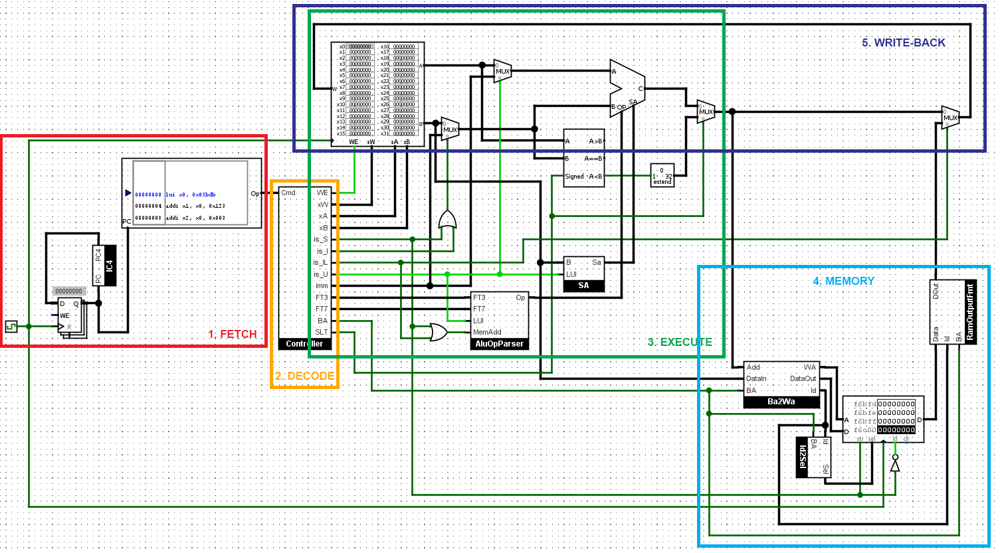
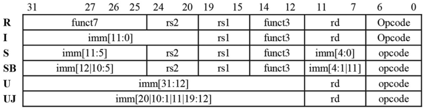

# Project 2 - RISC-V Processor Documentation

## Table of Contents
  - [Overview](#overview)
  - [Fetch](#fetch)
    - [IC4](#ic4)
  - [Decode](#decode)
    - [Decoding instruction parts](#decoding-instruction-parts)
    - [Detecting format types](#detecting-format-types)
    - [Register file interface](#register-file-interface)
    - [12-bit immediate values](#12-bit-immediate-values)
    - [Controller output pins](#controller-output-pins)
      - [Type detector](#type-detector)
      - [32-bit immediate values](#32-bit-immediate-values)
      - [funct3, funct7](#funct3-funct7)
      - [LB/SB, SLT instruction signals](#lbsb-slt-instruction-signals)
  - [Execute](#execute)
  - [Memory](#memory)
  - [Write-back](#write-back)
  - [Handling for specific instructions](#handling-for-specific-instructions)
    - [SLL, SRA, LUI](#sll-sra-lui)
    - [SLT, SLTI](#slt-slti)

## Overview

This is a Logisim design of a 32-bit RISC-V processor. It supports a subset of RISC-V instructions listed below.

|Format|Instructions|
|:-:|:-|
|R-type|ADD, SUB, AND, OR, XOR, SLT, SLL, SRA|
|I-type|ADDI, ANDI, ORI, XORI, SLTI, LW, LB|
|S-type|SW, SB|
|U-type|LUI|

Each stage is illustrated in the below diagram. This document will be organized according to the 5 stages of instruction.

## Fetch
At this stage, instructions from the Program ROM will be fetched to the decoder.

The Program Counter (PC) value is stored in a register, then continuously fetched to the Program ROM and increased by 4 for each clock rising edge.

### IC4
The IC4 circuit adds 4 to the input by separating the least 2 bits 0 and 1, then incrementing 1 to bit 2 (), and merging these two together by a splitter, so that the whole process can be achieved by just a single incrementer.

## Decode

The Controller circuit decodes the incoming instruction into multiple parts and send them to their approriate function circuits.

### Decoding instruction parts
These mix of splitters split the incoming instruction into all possible parts regardless of the combination according to the RISC-V instruction format.

### Detecting format types
This part detects what format type the instruction is. By getting the 7-bit opcode of the instruction and split those bits, this circuit can classify the format according to its unique characteristics from the others.

|Opcode|Format|Characteristics|
|:-:|:-:|:--|
|0110011|R-type|Bit 2 is off and bits 4, 5 are on|
|0010011|I-type|Bit 5 is off|
|0000011|IL-type|Bit 5 is off (I-type) **and** bit 4 is off|
|0100011|S-type|Bit 4 is off and bit 5 is on|
|0110111|U-type|Bit 2 is on|

Note that, in this circuit design, a format named IL-type is defined. IL-type is a subset of I-type format specifically for the LB and LW instructions to differentiate from other I-type instructions ADDI, ANDI, ORI, XORI, SLTI. It is not an official specification in RISC-V documentation; it is rather a convention for this project only.

### Register file interface

These output pins are connected to their respective register file input pins. xW, xA and xB are connected to tunnels rd, rs1, rs2 accordingly to represent the index of the three registers.

WE is the Write-Enabled signal, and is activated if the opcode is not of the S-type. Since S-type instructions store words/bytes from the register file to RAM, writing to register file is disabled for those instructions.

### 12-bit immediate values
There are two RISC-V instruction formats that contain 12-bit immediate values in different ways: I-type and S-type.

while I-type's last imm block contains the whole 12-bit imm, that in the S-type is splitted into two 5-bit and 7-bit segments.

The below part of the Controller joins those 2 parts and select which 12-bit imm to be the output. If the Opcode is of I-type, then the 12-bit imm block is chosen, otherwise the jointed imm is the output, for the tunnel imm_12.

### Controller output pins

These pins collect their respective inputs, with some controlling gates, to output accordingly to the RISC-V instruction.

#### Type detector

The 4 pins is_S, is_I, is_IL, is_U send their signal outside the controller to multiplexors so that they can choose the input corresponding to the instruction. is_U is also used for detecting LUI command, which needs special treatment that will be mentioned later in this document.

#### 32-bit immediate values

All immediate values need to be extended 32-bit long. While I-type and S-type contain 12-bit imm that needs to be sign-extended, U-type contains a 20-bit imm to be zero-extended. The U-type signal is used to select which imm to be the output of the controller.

#### funct3, funct7

In this part, FT3 and FT7 are the output of funct3 and funct7 in supported RISC-V instruction. U-type signal controls whether FT3 can be outputted, and so does R-type for FT7.

#### LB/SB, SLT instruction signals

## Execute

## Memory

## Write-back

## Special handling for specific instructions

### SLL, SRA, LUI

### SLT, SLTI